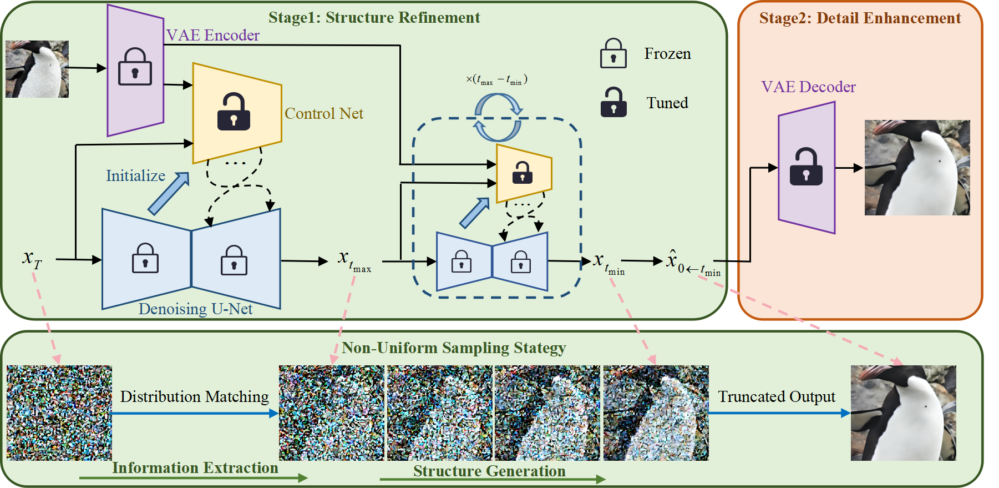
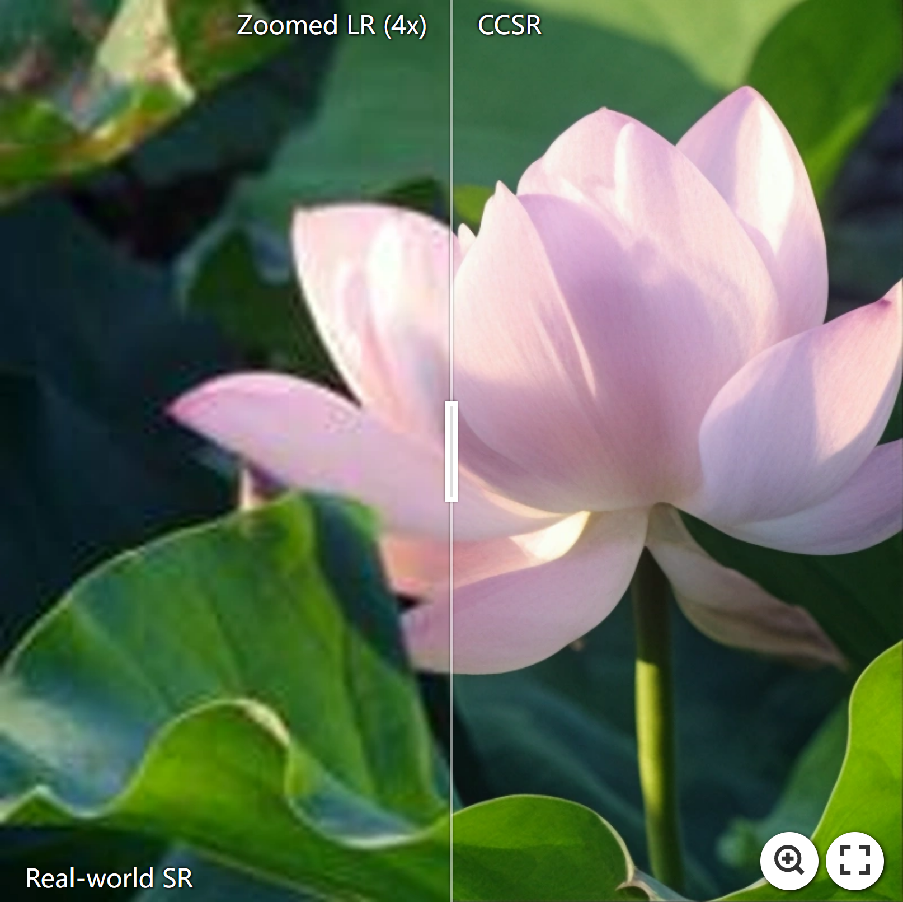
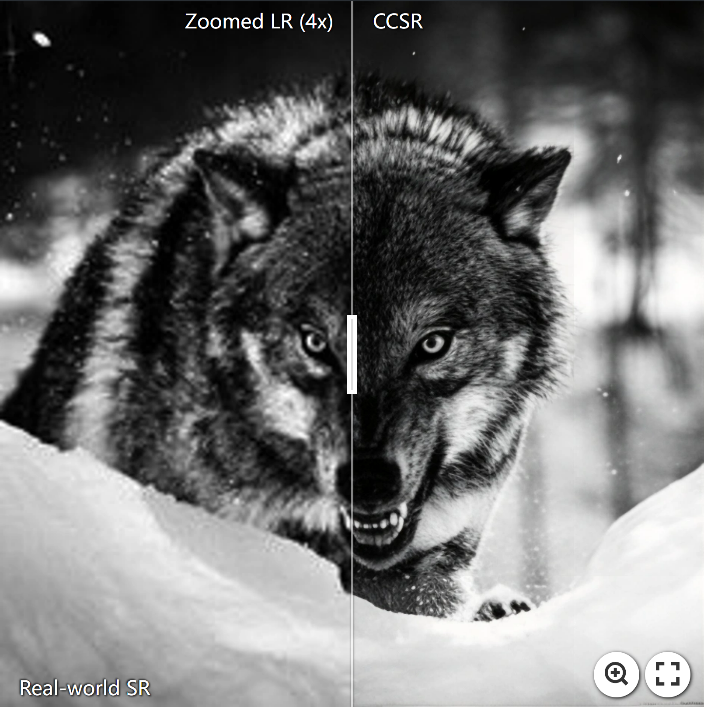
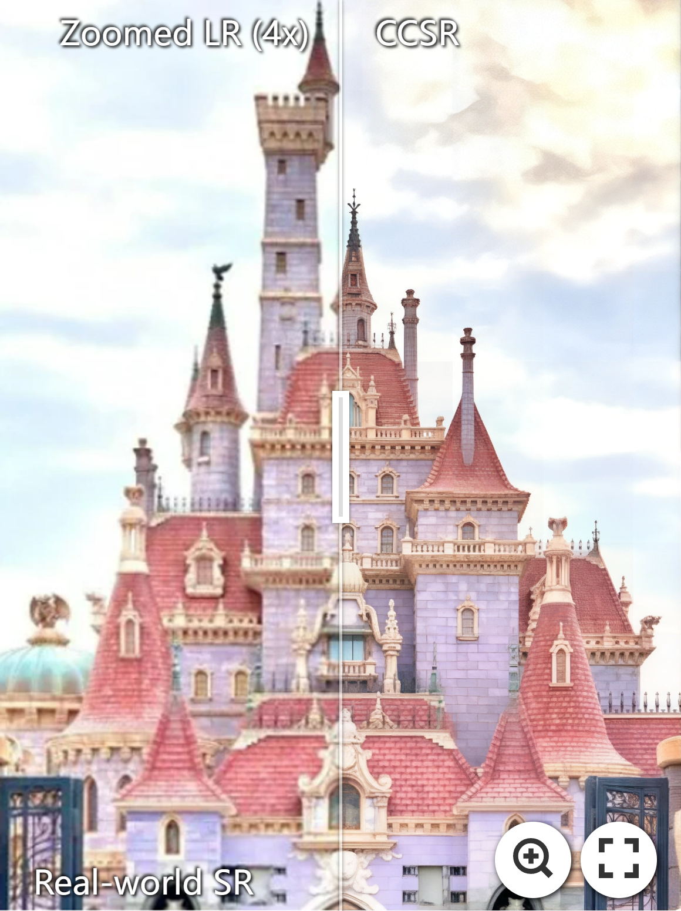
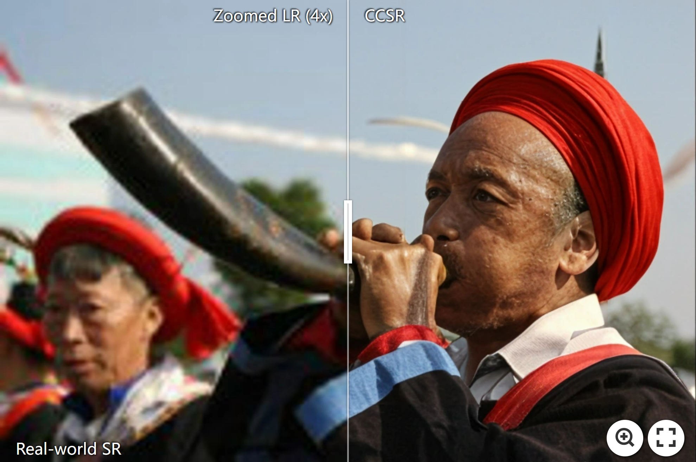
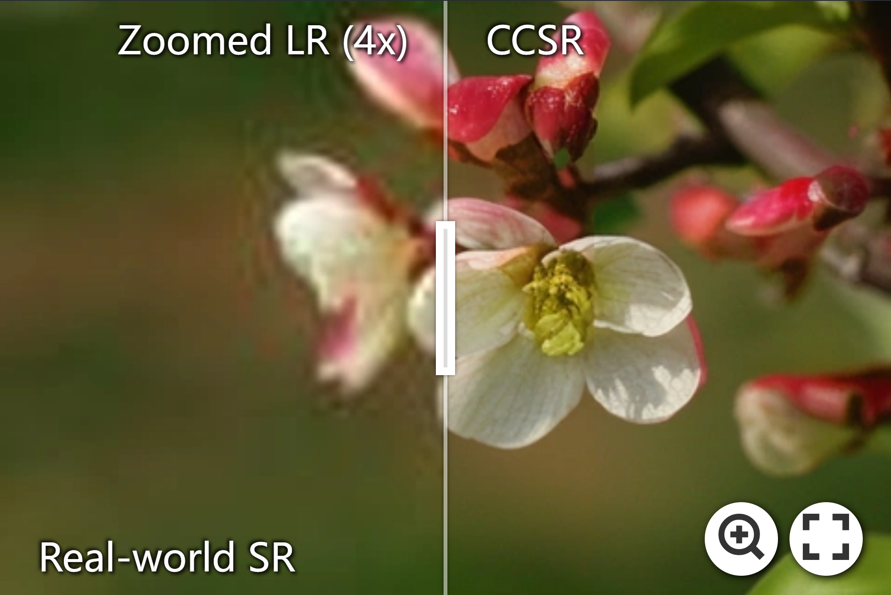
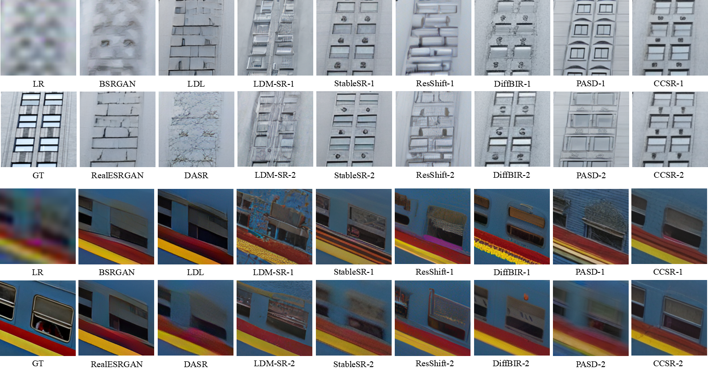
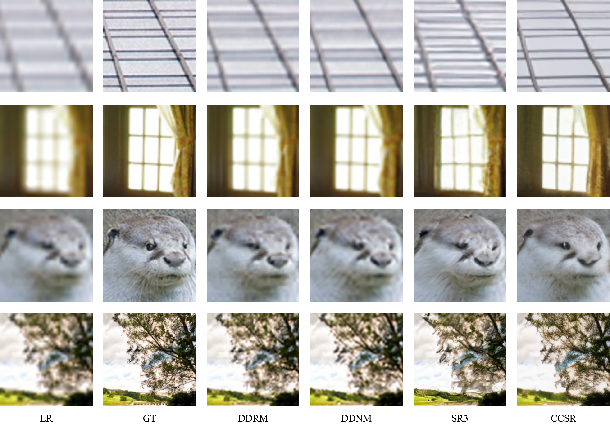
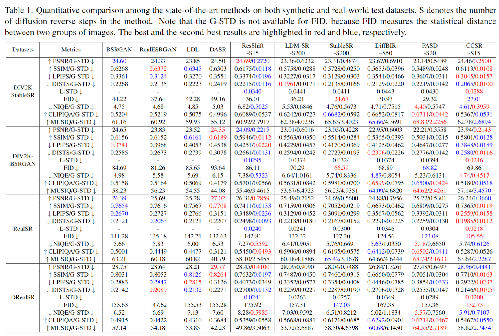

<p align="center">
    
</p>

## Improving the Stability of Diffusion Models for Content Consistent Super-Resolution


<a href='https://arxiv.org/pdf/2401.00877.pdf'></a> <a href='https://csslc.github.io/project-CCSR'></a> <a href='https://github.com/csslc/CCSR'></a> [](https://colab.research.google.com/github/camenduru/CCSR-colab/blob/main/CCSR_colab.ipynb) 


[Lingchen Sun](https://scholar.google.com/citations?hl=zh-CN&tzom=-480&user=ZCDjTn8AAAAJ)<sup>1,2</sup>
| [Rongyuan Wu](https://scholar.google.com/citations?user=A-U8zE8AAAAJ&hl=zh-CN)<sup>1,2</sup> | 
[Zhengqiang Zhang](https://scholar.google.com/citations?hl=zh-CN&user=UX26wSMAAAAJ&view_op=list_works&sortby=pubdate)<sup>1,2</sup> | 
[Hongwei Yong](https://scholar.google.com.hk/citations?user=Xii74qQAAAAJ&hl=zh-CN)<sup>1</sup> | 
[Lei Zhang](https://www4.comp.polyu.edu.hk/~cslzhang)<sup>1,2</sup>

<sup>1</sup>The Hong Kong Polytechnic University, <sup>2</sup>OPPO Research Institute


## ⏰ Update
- **2024.1.14**: Integrate [tile_diffusion](https://github.com/albarji/mixture-of-diffusers) and [tile_vae](https://github.com/pkuliyi2015/multidiffusion-upscaler-for-automatic1111/tree/main) to the [inference_ccsr_tile.py](inference_ccsr_tile.py) to save the GPU memory for inference.
- **2024.1.10**: Update [CCSR colab demo](https://colab.research.google.com/github/camenduru/CCSR-colab/blob/main/CCSR_colab.ipynb). ❤ Thank [camenduru](https://github.com/camenduru/CCSR-colab) for the implementation!
- **2024.1.4**: Code and the model for real-world SR are released.
- **2024.1.3**: Paper is released.
- **2023.12.23**: Repo is released.


:star: If CCSR is helpful to your images or projects, please help star this repo. Thanks! :hugs:

## 🌟 Overview Framework


## 😍 Visual Results
### Demo on Real-World SR
[](https://imgsli.com/MjMxMzA0) [](https://imgsli.com/MjMxMzEx) [](https://imgsli.com/MjMxMzE1) [](https://imgsli.com/MjMxMzI3)
[](https://imgsli.com/MjMxMzEy) [](https://imgsli.com/MjMxMzE5) 

### Comparisons on Real-World SR
For the diffusion model-based method, two restored images that have the best and worst PSNR values over 10 runs are shown for a more comprehensive and fair comparison. 



### Comparisons on Bicubic SR

For more comparisons, please refer to our paper for details.

## 📝 Quantitative comparisons
We propose new stability metrics, namely global standard deviation (G-STD) and local standard deviation (L-STD), to respectively measure the image-level and pixel-level variations of the SR results of diffusion-based methods.

More details about G-STD and L-STD can be found in our paper.


## ⚙ Dependencies and Installation
```shell
## git clone this repository
git clone https://github.com/csslc/CCSR.git
cd CCSR

# create an environment with python >= 3.9
conda create -n ccsr python=3.9
conda activate ccsr
pip install -r requirements.txt
pip install -e git+https://github.com/CompVis/taming-transformers.git@master#egg=taming-transformers
```
## 🍭 Quick Inference
#### Step 1: Download the pretrained models
- Download the CCSR models from:

| Model Name           | Description                                  | GoogleDrive                                                                           | BaiduNetdisk                                                            |
|:---------------------|:---------------------------------------------|:--------------------------------------------------------------------------------------|:------------------------------------------------------------------------|
| real-world_ccsr.ckpt | CCSR model for real-world image restoration. | [download](https://drive.google.com/drive/folders/1jM1mxDryPk9CTuFTvYcraP2XIVzbPiw_?usp=drive_link) | [download](https://pan.baidu.com/s/1uYi0-8nyH35P5rMsLD1J0w) (pwd: CCSR) |
| bicubic_ccsr.ckpt    | CCSR model for bicubic image restoration.    | download                                                                              | download                                                                |

#### Step 2: Prepare testing data
You can put the testing images in the `preset/test_datasets`.

#### Step 3: Running testing command
```
python inference_ccsr.py \
--input preset/test_datasets \
--config configs/model/ccsr_stage2.yaml \
--ckpt weights/real-world_ccsr.ckpt \
--steps 45 \
--sr_scale 4 \
--t_max 0.6667 \
--t_min 0.3333 \
--color_fix_type adain \
--output experiments/test \
--device cuda \
--repeat_times 1 
```
We integrate [tile_diffusion](https://github.com/albarji/mixture-of-diffusers) and [tile_vae](https://github.com/pkuliyi2015/multidiffusion-upscaler-for-automatic1111/tree/main) to the [inference_ccsr_tile.py](inference_ccsr_tile.py) to save the GPU memory for inference.
You can change the tile size and stride according to the VRAM of your device.
```
python inference_ccsr_tile.py \
--input preset/test_datasets \
--config configs/model/ccsr_stage2.yaml \
--ckpt weights/real-world_ccsr.ckpt \
--steps 45 \
--sr_scale 4 \
--t_max 0.6667 \
--t_min 0.3333 \
--tile_diffusion \
--tile_diffusion_size 512 \
--tile_diffusion_stride 256 \
--tile_vae \
--vae_decoder_tile_size 224 \
--vae_encoder_tile_size 1024 \
--color_fix_type adain \
--output experiments/test \
--device cuda \
--repeat_times 1
```

You can obtain `N` different SR results by setting `repeat_time` as `N` to test the stability of CCSR. The data folder should be like this:

```
 experiments/test
 ├── sample0   # the first group of SR results 
 └── sample1   # the second group of SR results 
   ...
 └── sampleN   # the N-th group of SR results 
```

## 📏 Evaluation
1. Calculate the Image Quality Assessment for each restored group.

   Fill in the required information in [cal_iqa.py](cal_iqa/cal_iqa.py) and run, then you can obtain the evaluation results in the folder like this:
   ```
    log_path
    ├── log_name_npy  # save the IQA values of each restored group as the npy files
    └── log_name.log   # log recode
   ```

2. Calculate the G-STD value for the diffusion-based SR method.

   Fill in the required information in [iqa_G-STD.py](cal_iqa/iqa_G-STD.py) and run, then you can obtain the mean IQA values of N restored groups and G-STD value.

3. Calculate the L-STD value for the diffusion-based SR method.

   Fill in the required information in [iqa_L-STD.py](cal_iqa/iqa_L-STD.py) and run, then you can obtain the L-STD value.


## 🚋 Train 

#### Step1: Prepare training data

1. Generate file list of training set and validation set.

    ```shell
   python scripts/make_file_list.py \
   --img_folder [hq_dir_path] \
   --val_size [validation_set_size] \
   --save_folder [save_dir_path] \
   --follow_links
    ```
    
    This script will collect all image files in `img_folder` and split them into training set and validation set automatically. You will get two file lists in `save_folder`, each line in a file list contains an absolute path of an image file:
    
    ```
    save_dir_path
    ├── train.list # training file list
    └── val.list   # validation file list
    ```

2. Configure training set and validation set.

    For real-world image restoration, fill in the following configuration files with appropriate values.

    - [training set](configs/dataset/general_deg_stablesr_realesrgan_train.yaml) and [validation set](configs/dataset/general_deg_stablesr_realesrgan_val.yaml) for **Real-ESRGAN** degradation.
 
#### Step2: Train Stage1 Model
1. Download pretrained [Stable Diffusion v2.1](https://huggingface.co/stabilityai/stable-diffusion-2-1-base) to provide generative capabilities.

    ```shell
    wget https://huggingface.co/stabilityai/stable-diffusion-2-1-base/resolve/main/v2-1_512-ema-pruned.ckpt --no-check-certificate
    ```

2. Create the initial model weights.

    ```shell
   python scripts/make_stage2_init_weight.py \
   --cldm_config configs/model/ccsr_stage1.yaml \
   --sd_weight [sd_v2.1_ckpt_path] \
   --output weights/init_weight_ccsr.ckpt
    ```
   
3. Configure training-related information.

    Fill in the configuration file of [training of stage1](configs/train_ccsr_stage1.yaml) with appropriate settings.

4. Start training.

    ```shell
    python train.py --config configs/train_ccsr_stage1.yaml
    ```

#### Step3: Train Stage2 Model
1. Configure training-related information.

    Fill in the configuration file of [training of stage2](configs/train_ccsr_stage2.yaml) with appropriate settings.

2. Start training.
   ```shell
    python train.py --config configs/train_ccsr_stage2.yaml
    ```

### Citations
If our code helps your research or work, please consider citing our paper.
The following are BibTeX references:

```
@article{sun2023ccsr,
  title={Improving the Stability of Diffusion Models for Content Consistent Super-Resolution},
  author={Sun, Lingchen and Wu, Rongyuan and Zhang, Zhengqiang and Yong, Hongwei and Zhang, Lei},
  journal={arXiv preprint arXiv:2401.00877},
  year={2024}
}
```

### License
This project is released under the [Apache 2.0 license](LICENSE).

### Acknowledgement
This project is based on [ControlNet](https://github.com/lllyasviel/ControlNet), [BasicSR](https://github.com/XPixelGroup/BasicSR) and [DiffBIR](https://github.com/XPixelGroup/DiffBIR). Some codes are brought from [StableSR](https://github.com/IceClear/StableSR). Thanks for their awesome works. 

### Contact
If you have any questions, please contact: ling-chen.sun@connect.polyu.hk


<details>
<summary>statistics</summary>


</details>


